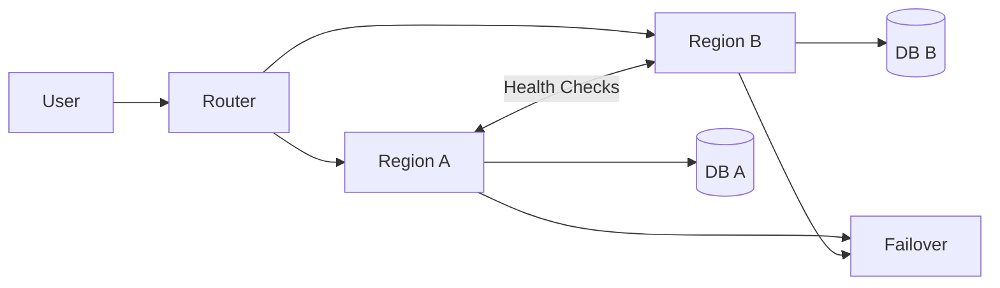

# Multi Region Architecture

```mermaid
flowchart LR

    User --> Router

    Router --> RegionA[Region A]

    Router --> RegionB[Region B]

    RegionA --> PostgreSQLA[(DB A)]

    RegionB --> PostgreSQLB[(DB B)]

    RegionA <-->|Health Checks| RegionB

    RegionA --> Failover

    RegionB --> Failover
```
